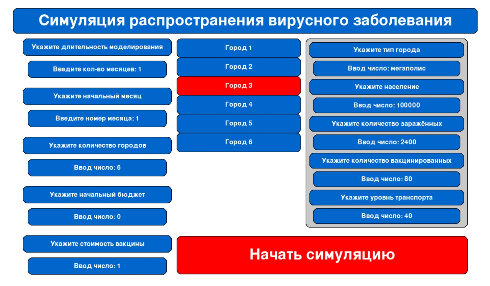
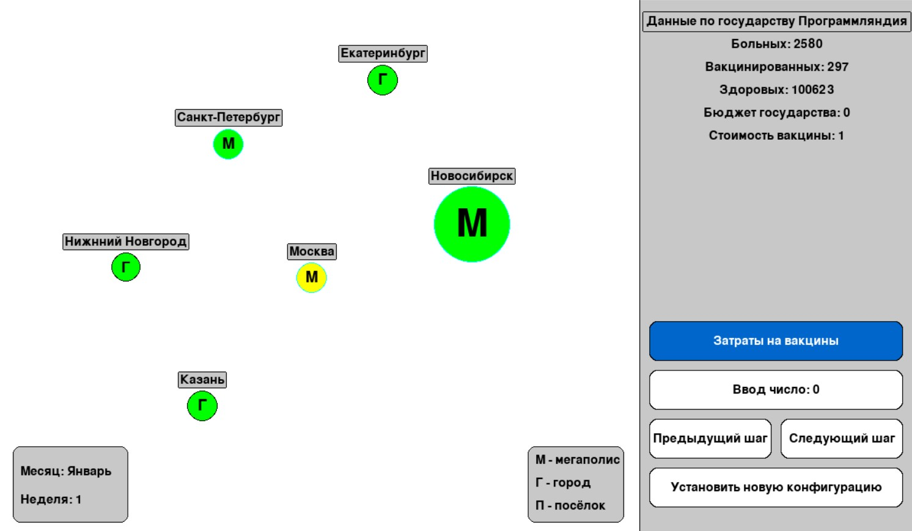

# Моделирование распространения вирусного заболевания

Проект представляет собой компьютерную модель распространения вирусного заболевания в стране с несколькими городами. Модель учитывает такие факторы, как численность населения, транспортное сообщение, процент заболевших и вакцинированных, а также сезонность.

## Описание

Модель позволяет:
- Симулировать распространение вируса в городах разных типов (мегаполисы, средние города, посёлки).
- Учитывать влияние транспортного сообщения и сезонности на заболеваемость.
- Проводить стратегии вакцинации для минимизации числа заболевших.
- Визуализировать процесс распространения вируса.

## Установка и запуск

1. Убедись, что у тебя установлен Python 3.10 или выше.
2. Клонируй репозиторий:
    ```bash
    git clone https://github.com/AirMannanov/Viral-disease-model.git
    cd Viral-disease-model
3. Установи зависимости:
    ```bash
    pip install -r requirements.txt
4. Запусти симуляцию
    ```bash
    python main.py

## Скрины

Конфигурация симуляции


Симуляция

